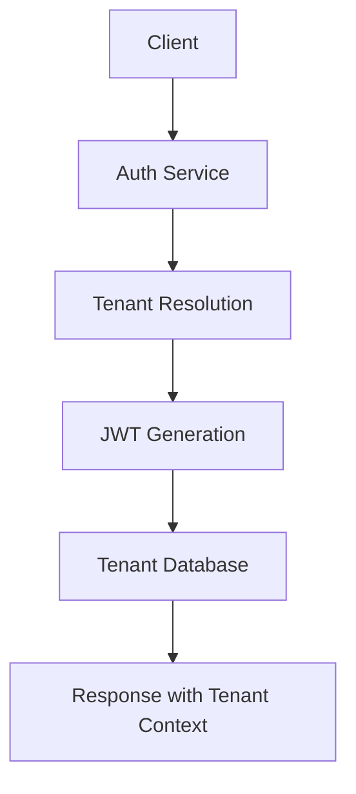
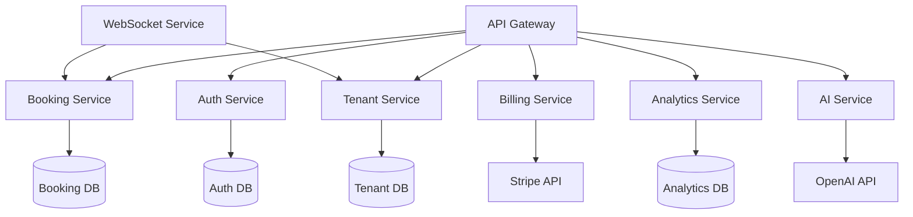

# 🚀 Boom Booking SaaS Scaling Master Plan

## 📋 **Executive Summary**

This document outlines the comprehensive strategy for transforming Boom Karaoke booking system from a single-tenant application to a multi-tenant SaaS platform with subscription management, enhanced AI features, and robust infrastructure for tracking and fixing calendar/booking issues.

---

## 🏗️ **Current Architecture Analysis**

### **Existing Tech Stack**
- **Frontend**: React 18 + Vite + Tailwind CSS + React Query + Socket.IO
- **Backend**: Node.js + Express.js + SQLite + JWT + Socket.IO
- **Database**: SQLite with 5 tables (users, rooms, bookings, business_hours, settings)
- **Authentication**: JWT with bcrypt password hashing
- **Real-time**: Socket.IO for live updates

### **Current Limitations for SaaS**
1. **Single-tenant architecture** - all data in one database
2. **No subscription management** - no billing or payment integration
3. **Limited user management** - basic role system
4. **No multi-tenancy** - can't serve multiple businesses
5. **No audit trails** - difficult to track booking changes
6. **SQLite limitations** - not suitable for production SaaS scaling

---

## 🎯 **Phase 1: Multi-Tenant Database Architecture (Weeks 1-3)**

### **Database Migration Strategy**

#### **Option A: Database-per-Tenant (Recommended)**
```sql
-- New database structure per tenant
CREATE DATABASE boom_tenant_[tenant_id];

-- Core tables remain the same but with tenant isolation
CREATE TABLE users (
  id UUID PRIMARY KEY DEFAULT gen_random_uuid(),
  tenant_id UUID NOT NULL REFERENCES tenants(id),
  email TEXT UNIQUE NOT NULL,
  password TEXT NOT NULL,
  name TEXT NOT NULL,
  role TEXT DEFAULT 'user',
  subscription_tier TEXT DEFAULT 'basic',
  created_at TIMESTAMP DEFAULT CURRENT_TIMESTAMP,
  updated_at TIMESTAMP DEFAULT CURRENT_TIMESTAMP
);

-- Add tenant context to all existing tables
ALTER TABLE rooms ADD COLUMN tenant_id UUID NOT NULL;
ALTER TABLE bookings ADD COLUMN tenant_id UUID NOT NULL;
ALTER TABLE business_hours ADD COLUMN tenant_id UUID NOT NULL;
ALTER TABLE settings ADD COLUMN tenant_id UUID NOT NULL;
```

#### **New SaaS Tables**
```sql
-- Tenant Management
CREATE TABLE tenants (
  id UUID PRIMARY KEY DEFAULT gen_random_uuid(),
  name TEXT NOT NULL,
  subdomain TEXT UNIQUE,
  domain TEXT,
  plan_type TEXT DEFAULT 'starter',
  status TEXT DEFAULT 'active',
  stripe_customer_id TEXT,
  created_at TIMESTAMP DEFAULT CURRENT_TIMESTAMP,
  updated_at TIMESTAMP DEFAULT CURRENT_TIMESTAMP
);

-- Subscription Management
CREATE TABLE subscriptions (
  id UUID PRIMARY KEY DEFAULT gen_random_uuid(),
  tenant_id UUID NOT NULL REFERENCES tenants(id),
  stripe_subscription_id TEXT UNIQUE,
  plan_type TEXT NOT NULL,
  status TEXT NOT NULL,
  current_period_start TIMESTAMP,
  current_period_end TIMESTAMP,
  created_at TIMESTAMP DEFAULT CURRENT_TIMESTAMP,
  FOREIGN KEY (tenant_id) REFERENCES tenants (id)
);

-- Usage Tracking
CREATE TABLE usage_metrics (
  id UUID PRIMARY KEY DEFAULT gen_random_uuid(),
  tenant_id UUID NOT NULL REFERENCES tenants(id),
  metric_type TEXT NOT NULL,
  metric_value INTEGER NOT NULL,
  recorded_at TIMESTAMP DEFAULT CURRENT_TIMESTAMP,
  FOREIGN KEY (tenant_id) REFERENCES tenants (id)
);

-- Audit Trail
CREATE TABLE audit_logs (
  id UUID PRIMARY KEY DEFAULT gen_random_uuid(),
  tenant_id UUID NOT NULL REFERENCES tenants(id),
  user_id UUID REFERENCES users(id),
  action TEXT NOT NULL,
  entity_type TEXT NOT NULL,
  entity_id TEXT NOT NULL,
  old_values JSONB,
  new_values JSONB,
  ip_address INET,
  user_agent TEXT,
  created_at TIMESTAMP DEFAULT CURRENT_TIMESTAMP
);
```

---

## 🔄 **Phase 2: Application Communication Network**

### **API Architecture Redesign**

#### **Authentication Flow**


#### **Multi-Tenant API Structure**
```
/api/v1/
├── /auth/
│   ├── POST /login (tenant-aware)
│   ├── POST /register (with tenant creation)
│   └── POST /refresh
├── /tenants/
│   ├── GET /current
│   ├── PUT /settings
│   └── GET /usage
├── /rooms/
│   ├── GET / (tenant-filtered)
│   ├── POST / (with tenant_id)
│   ├── PUT /:id (tenant-validated)
│   └── DELETE /:id (tenant-validated)
├── /bookings/
│   ├── GET / (tenant-filtered)
│   ├── POST / (with audit trail)
│   ├── PUT /:id (with change tracking)
│   └── DELETE /:id (soft delete)
├── /analytics/
│   ├── GET /dashboard (tenant-specific)
│   ├── GET /reports (usage metrics)
│   └── GET /trends (AI-powered insights)
└── /billing/
    ├── GET /subscription
    ├── POST /upgrade
    └── GET /usage
```

### **Service Communication Network**

#### **Microservices Architecture**


---

## 📊 **Phase 3: Enhanced Calendar & Booking Tracking**

### **Audit Trail Implementation**

#### **Booking Change Tracking**
```javascript
// Enhanced booking service with audit trail
class BookingService {
  async updateBooking(tenantId, bookingId, updates, userId) {
    const oldBooking = await this.getBooking(tenantId, bookingId);
    
    // Track changes
    const changes = this.detectChanges(oldBooking, updates);
    
    // Create audit log
    await this.auditService.log({
      tenant_id: tenantId,
      user_id: userId,
      action: 'booking_updated',
      entity_type: 'booking',
      entity_id: bookingId,
      old_values: oldBooking,
      new_values: updates,
      changes: changes
    });
    
    // Update booking
    const newBooking = await this.db.updateBooking(tenantId, bookingId, updates);
    
    // Emit real-time update
    this.websocketService.broadcastToTenant(tenantId, 'booking_updated', newBooking);
    
    return newBooking;
  }
}
```

#### **Calendar Conflict Detection**
```javascript
class ConflictDetector {
  async detectConflicts(tenantId, newBooking) {
    const conflicts = await this.db.query(`
      SELECT * FROM bookings 
      WHERE tenant_id = ? 
      AND room_id = ?
      AND status != 'cancelled'
      AND (
        (start_time < ? AND end_time > ?) OR
        (start_time < ? AND end_time > ?) OR
        (start_time >= ? AND end_time <= ?)
      )
    `, [tenantId, newBooking.room_id, newBooking.start_time, newBooking.start_time, 
        newBooking.end_time, newBooking.end_time, newBooking.start_time, newBooking.end_time]);
    
    return conflicts;
  }
}
```

---

## 🤖 **Phase 4: AI Integration Points**

### **AI-Powered Features**

#### **1. Smart Booking Assistant**
```javascript
class AIBookingAssistant {
  async suggestOptimalTimes(tenantId, preferences) {
    const response = await this.openai.chat.completions.create({
      model: "gpt-4",
      messages: [{
        role: "system",
        content: `You are a booking assistant for ${tenantId}. 
                 Analyze booking patterns and suggest optimal times.`
      }, {
        role: "user", 
        content: `Suggest best times for ${preferences.groupSize} people 
                 on ${preferences.date} considering availability and pricing.`
      }]
    });
    
    return this.parseSuggestions(response.choices[0].message.content);
  }
}
```

#### **2. Predictive Analytics**
```javascript
class PredictiveAnalytics {
  async predictDemand(tenantId, dateRange) {
    const historicalData = await this.analyticsService.getHistoricalBookings(tenantId);
    
    const prediction = await this.openai.chat.completions.create({
      model: "gpt-4",
      messages: [{
        role: "system",
        content: "You are a demand forecasting AI for booking systems."
      }, {
        role: "user",
        content: `Based on this data: ${JSON.stringify(historicalData)}, 
                 predict demand for ${dateRange}.`
      }]
    });
    
    return this.parsePrediction(prediction.choices[0].message.content);
  }
}
```

#### **3. Automated Customer Support**
```javascript
class AICustomerSupport {
  async handleInquiry(tenantId, message) {
    const context = await this.getTenantContext(tenantId);
    
    const response = await this.openai.chat.completions.create({
      model: "gpt-4",
      messages: [{
        role: "system",
        content: `You are a customer support assistant for ${context.businessName}. 
                 Help with booking inquiries and provide helpful information.`
      }, {
        role: "user",
        content: message
      }]
    });
    
    return response.choices[0].message.content;
  }
}
```

---

## 🏛️ **Infrastructure Adjustments**

### **Directory Structure Changes**

#### **New Project Structure**
```
boom-booking-saas/
├── apps/
│   ├── web/                    # Customer-facing website
│   ├── dashboard/              # Business dashboard (current app)
│   └── admin/                  # Super admin panel
├── services/
│   ├── auth-service/           # Authentication & authorization
│   ├── booking-service/        # Core booking logic
│   ├── tenant-service/         # Multi-tenant management
│   ├── billing-service/        # Subscription & payments
│   ├── analytics-service/      # Data analytics
│   ├── ai-service/            # AI features
│   └── notification-service/   # Email/SMS notifications
├── shared/
│   ├── database/              # Database schemas & migrations
│   ├── types/                 # Shared TypeScript types
│   ├── utils/                 # Common utilities
│   └── middleware/            # Shared middleware
├── infrastructure/
│   ├── docker/                # Container configs
│   ├── k8s/                   # Kubernetes manifests
│   └── terraform/             # Infrastructure as code
└── docs/
    ├── api/                   # API documentation
    ├── architecture/          # System design docs
    └── deployment/            # Deployment guides
```

### **Technology Stack Upgrades**

#### **Database Migration**
- **From**: SQLite
- **To**: PostgreSQL (multi-tenant support)
- **Backup**: Redis for caching
- **Search**: Elasticsearch for advanced queries

#### **Backend Architecture**
- **From**: Monolithic Express.js
- **To**: Microservices with Express.js + Docker
- **API**: GraphQL + REST hybrid
- **Message Queue**: Redis Bull for job processing

#### **Frontend Evolution**
- **From**: Single React app
- **To**: Multiple apps (customer website + business dashboard)
- **State**: Redux Toolkit + React Query
- **UI**: Tailwind CSS + Headless UI

---

## 📈 **Subscription Tiers & Pricing**

### **Tier Structure**

#### **Starter Plan - $29/month**
- Up to 5 rooms
- 100 bookings/month
- Basic calendar view
- Email notifications
- Standard support

#### **Professional Plan - $79/month**
- Up to 20 rooms
- 500 bookings/month
- Advanced calendar + analytics
- SMS notifications
- AI booking suggestions
- Priority support

#### **Enterprise Plan - $199/month**
- Unlimited rooms
- Unlimited bookings
- Custom integrations
- Advanced AI features
- White-label options
- Dedicated support

---

## 🔧 **Implementation Timeline**

### **Week 1-3: Foundation**
- [ ] Database migration to PostgreSQL
- [ ] Multi-tenant architecture setup
- [ ] Basic tenant management
- [ ] Authentication system upgrade

### **Week 4-6: Core Features**
- [ ] Subscription management
- [ ] Billing integration (Stripe)
- [ ] Audit trail implementation
- [ ] Enhanced booking system

### **Week 7-9: AI Integration**
- [ ] Smart booking assistant
- [ ] Predictive analytics
- [ ] Automated support chatbot
- [ ] Demand forecasting

### **Week 10-12: Polish & Launch**
- [ ] Customer-facing website
- [ ] Performance optimization
- [ ] Security hardening
- [ ] Documentation completion

---

## 🛡️ **Security & Compliance**

### **Data Protection**
- **Encryption**: AES-256 for data at rest, TLS 1.3 for data in transit
- **Backup**: Automated daily backups with 30-day retention
- **GDPR**: Full compliance with data protection regulations
- **SOC 2**: Security audit and compliance certification

### **Access Control**
- **RBAC**: Role-based access control for all features
- **API Security**: Rate limiting, request validation, JWT tokens
- **Tenant Isolation**: Complete data separation between tenants

---

## 📊 **Monitoring & Analytics**

### **System Monitoring**
- **APM**: Application Performance Monitoring
- **Logs**: Centralized logging with ELK stack
- **Metrics**: Real-time system metrics and alerts
- **Uptime**: 99.9% SLA with monitoring

### **Business Analytics**
- **Usage Metrics**: Track feature usage per tenant
- **Revenue Analytics**: Subscription and billing insights
- **Customer Health**: Churn prediction and retention metrics
- **Performance KPIs**: Response times, error rates, availability

---

## 🎯 **Success Metrics**

### **Technical KPIs**
- **System Uptime**: >99.9%
- **Response Time**: <200ms average
- **Error Rate**: <0.1%
- **Security**: Zero data breaches

### **Business KPIs**
- **Customer Acquisition**: 100+ tenants in first 6 months
- **Revenue Growth**: $10K MRR by month 6
- **Customer Satisfaction**: >4.5/5 rating
- **Feature Adoption**: >80% AI feature usage

---

This comprehensive plan provides a roadmap for transforming your Boom Karaoke booking system into a scalable, AI-powered SaaS platform. The phased approach ensures minimal disruption while building toward a robust, multi-tenant solution that can serve thousands of businesses.
